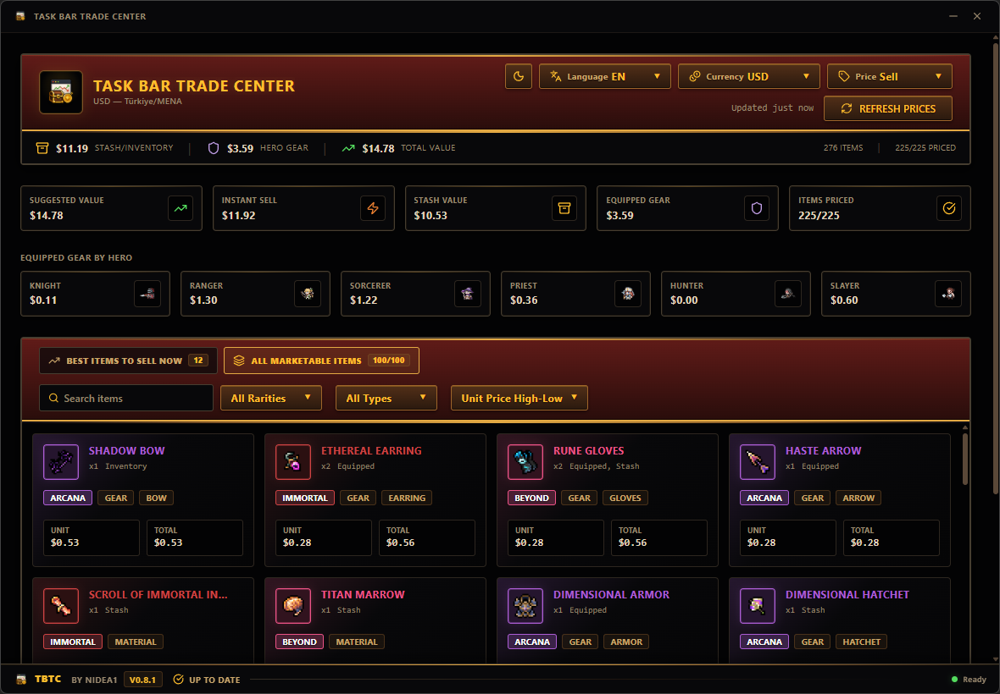
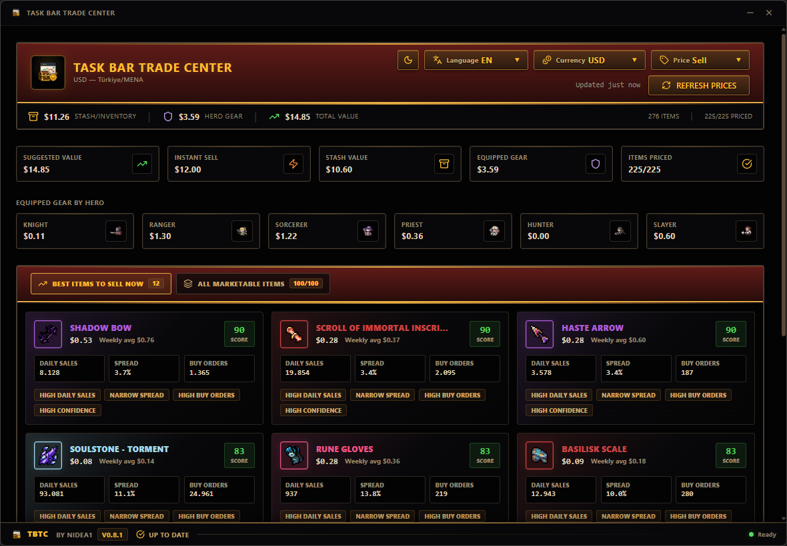
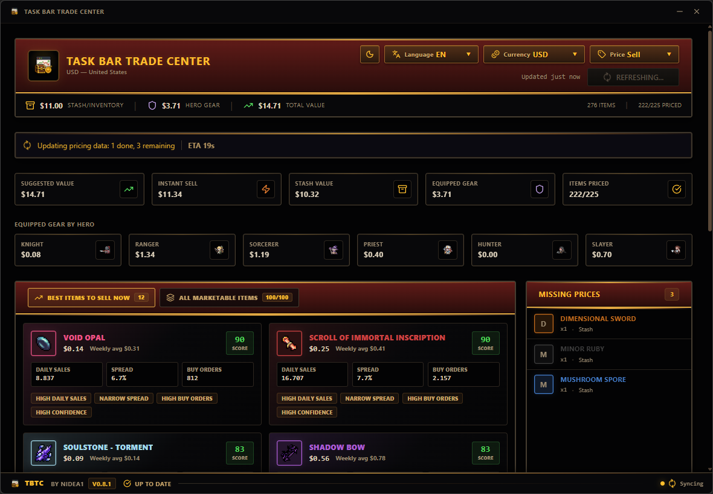
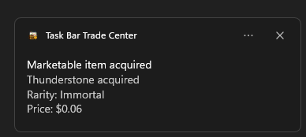

#  Task Bar Trade Center

[](https://www.patreon.com/16264399/join)
[](../../releases/latest)
[](../../releases)
[](../../stargazers)

Task Bar Trade Center is a modern Windows desktop companion and utility overlay for TaskBarHero, created by nidea1. It monitors the game in the background, tracks your player inventory directly from memory, schedules Steam Community Market pricing requests with built-in rate-limit protection, and displays a powerful real-time analytics dashboard along with a cursor-attached price overlay HUD.

---

## 🏗️ Architecture & How It Works

The application operates on a hybrid architecture designed for minimal system impact and seamless Windows integration:

- **Frontend (Wails + React + TypeScript + Vite):** A modern, high-performance desktop UI that displays your real-time portfolio value, active item details, pricing sync status, and automated item sale recommendations.
- **Backend (Go):** 
  - **Memory Hook & Scanner:** Attaches to `TaskBarHero.exe` to read player inventory state and active item coordinates.
  - **Steam SCM API Scheduler:** Safely queues price requests with adaptive rate-limiting, queuing, and backoffs to prevent Steam's HTTP 429 rate limit.
  - **Windows Shell Integration:** Manages system tray icons, handles background log rotation (capped at 5MB), and registers low-level Win32 notifications.

---

## ✨ Features

- **📊 Real-Time Inventory Dashboard:**
  - **Hotkey Toggle (F2):** Press `F2` system-wide at any time to instantly open or focus the dashboard.
  - **Portfolio Valuation:** Tracks total value (Suggested Listing vs. Instant Sell) of your inventory, stash pages, equipped gear, and gold.
  - **All Marketable Items:** A searchable list of all marketable items with locations, count, item grade/type, confidence metrics, and pricing.
  - **Best to Sell Now:** Uses an algorithm to score and suggest which items are best to sell based on sales volume, spread, and market demand.
  - **Sync & Queue Status:** Visually shows background API sync progress with ETA, backoff countdowns, and queue tracking.
  - **Missing Prices Tracker:** Flags items that haven't been priced yet.
- **👁️ Cursor-Attached Price Overlay HUD:**
  - Automatically draws a compact pricing HUD near the game tooltip as you hover over items in-game.
  - **Detail Mode:** Shows comprehensive statistics including suggested pricing, weekly averages, daily volume, trend percentages, spreads, buy/sell orders, and a deal assessment tag (e.g. "Undervalued", "Overvalued").
  - **Compact Mode:** A minimal HUD focused on essential price metrics to minimize screen footprint.
  - **Steam Listing Shortcut:** Press the middle mouse button while the overlay is visible to jump directly to the item's Steam Market page.
- **🔔 Obtained Item Notifications:**
  - Registers Windows tray notifications to immediately alert you when a marketable item is obtained or dropped, even when the dashboard window is closed.
- **🌐 Localization:**
  - Supports 17+ languages (English, German, French, Italian, Spanish, Dutch, Portuguese, Finnish, Japanese, Korean, Simplified Chinese, Hindi, Indonesian, Thai, Vietnamese, Polish, and Turkish).
- **⚙️ Tray Shell Companion:**
  - Compact menu to change languages, currency/country pairings, refresh or clear price cache, and check for updates.

---

## 📸 Screenshots

### 🖥️ Real-Time Inventory Dashboard

#### All Marketable Items View


#### Best Items to Sell & Analysis


#### Background Price Syncing Queue


---

### 🎮 In-game Price Overlay HUD

| Detail Mode Overlay | Compact Mode Overlay |
| :---: | :---: |
|  |  |

---

### 🔔 System Tray & Notifications

| Obtained Item Notification | System Tray Menu |
| :---: | :---: |
|  |  |

---

## 🚀 How to Download & Install

If you are not familiar with coding, follow these simple steps to install the app:

1. **Download the Program:**
   - Go to the [Releases](https://github.com/nidea1/task-bar-trade-center/releases) page.
   - Click on the latest release version.
   - Under the **Assets** section, download `tbtc.exe`.

2. **Run the Application:**
   - Place the downloaded `tbtc.exe` in any folder of your choice.
   - Double-click `tbtc.exe` to run it.
   - The app starts minimized. Locate the trade center icon in your Windows **System Tray** (near the clock, bottom-right). Double-click or right-click it to interact!
   - You can also press **`F2`** system-wide at any time to instantly open or focus the dashboard.

3. **Important Troubleshooting Tips:**
   - **Run as Administrator:** Since the application reads the game's memory space to locate tooltips and inventory items, Windows might block it. If the overlay/dashboard does not show up, right-click `tbtc.exe` and select **Run as administrator**.
   - **Antivirus Exclusion:** Due to process memory reading (`ReadProcessMemory`), some antivirus programs may flag it as a false-positive. The tool is fully safe. See [Antivirus & Security Warnings](#antivirus--security-warnings) below for details.

---

## 🛠️ Development & Building

Building this project requires:
- **Go 1.26.3 or newer**
- **Node.js (v18+) & npm**
- **Wails CLI** (installed via `go install github.com/wailsapp/wails/v2/cmd/wails@latest`)

### Local Development
To run the development server with live reload and automatic memory layout tracking:
```powershell
wails dev
```

### Production Build
To package the final single-file GUI executable without a console window:
```powershell
wails build -ldflags="-s -w -H=windowsgui"
```
The compiled executable will be placed in the `build/bin/` or `dist/` directory.

---

## 💾 User Data Paths

Config files, logs, and pricing cache are stored under your local AppData folder:

```text
%LOCALAPPDATA%\Task Bar Trade Center\config\settings.json          - User preferences (language, currency, country, modes)
%LOCALAPPDATA%\Task Bar Trade Center\config\game-layout-cache.json - Cached game memory layout downloaded from GitHub
%LOCALAPPDATA%\Task Bar Trade Center\logs\tbtc.log                 - Debug logs (automatically rotated, capped at 5MB)
%LOCALAPPDATA%\Task Bar Trade Center\cache\price-cache.json        - Persisted Steam SCM price cache
```

---

## 🧠 Game Memory Layout Configuration

Pointer chains and tooltip offsets are dynamically loaded from [game-layout.json](https://raw.githubusercontent.com/nidea1/task-bar-trade-center/main/game-layout.json). On startup, the app loads layout data from:
1. GitHub JSON file (with a 5-second timeout).
2. Locally cached JSON copy.
3. Fallback layout embedded within the executable.

If memory offsets fail continuously for 3 seconds while the HUD is active, the app hides the HUD and shows a warning. This ensures compatibility even when a game patch changes memory offsets without requiring an immediate app release.

---

## 🛡️ Antivirus & Security Warnings

Because this utility attaches to the `TaskBarHero.exe` process and reads its memory space (`ReadProcessMemory`) to dynamically locate tooltips and active item IDs, some security software may flag the executable as a heuristic or generic detection (false-positive). 

- **Permissions:** If the application fails to attach, make sure to **Run as Administrator**.
- **VirusTotal Scan:** For transparency, you can view the official VirusTotal analysis of compiled releases here:
  - [VirusTotal Analysis (Release v0.1.0)](https://www.virustotal.com/gui/file/a02f86e36b00630c7cb1dc08a19cb747b08b0a5c63bf2e8f337f22702012e7c2/detection)

---

## 💖 Support & Donations

If you find this tool helpful, feel free to support its development on Patreon!

[](https://www.patreon.com/16264399/join)

---

## 🤝 Acknowledgements & Credits

- Special thanks to the creators of [Allyans3/steam-market-api-v2](https://github.com/Allyans3/steam-market-api-v2) for API reference models.
- Thanks to the contributors of the [TaskBarHero Wiki](https://taskbarhero.wiki/) for providing the database structure for `items.json`.
