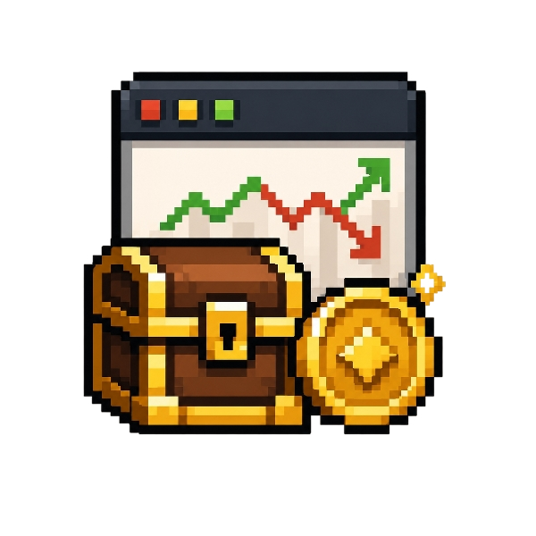
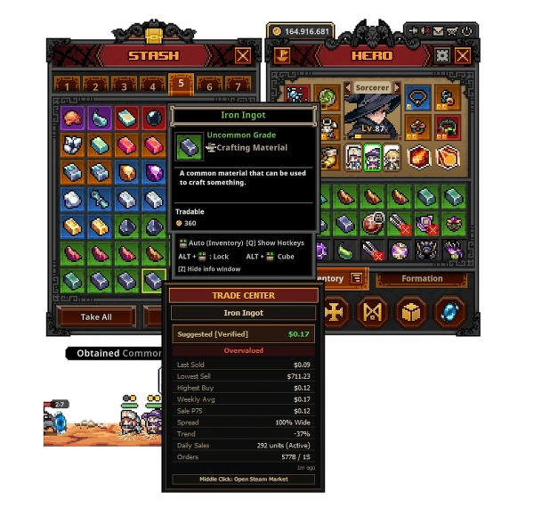
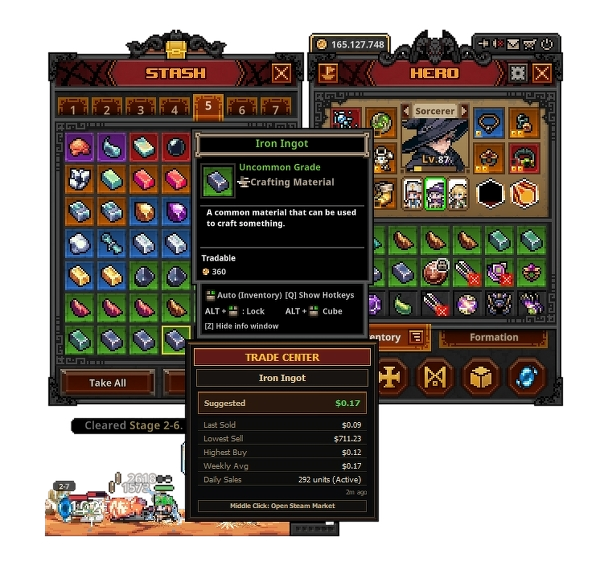
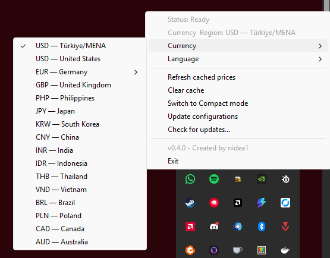

#  Task Bar Trade Center

[](https://www.patreon.com/16264399/join)

Task Bar Trade Center is a Windows tray utility for TaskBarHero, created by nidea1. It watches the item under the in-game cursor, fetches Steam Community Market pricing, and draws a small price HUD near the game tooltip.

## Features

- Runs from the Windows notification area and makes the tray icon available before network startup work completes.
- Left- or right-click the tray icon to open the action menu.
- Waits in the background until `TaskBarHero.exe` is launched.
- Shows the current monitoring state in the tray tooltip and reports runtime, configuration, and update transitions through tray notifications.
- When TaskBarHero closes, asks whether Task Bar Trade Center should exit; choosing No returns to the waiting state.
- Shows a compact market price overlay for marketable items (supports **Detail** and **Compact** modes).
- Lets you select a Steam Market currency and compatible country/region from the tray menu.
- Opens the active item's Steam Market listing with middle mouse button while the price overlay is visible.
- Uses `assets/icon.png` as the Windows application and tray icon.
- Embeds `items.json` into the executable, so release builds are single-file.
- Persists user preferences and price cache between launches.
- Uses the Windows display language by default and lets you choose English, German, French, Italian, Spanish, Dutch, Portuguese (Portugal/Brazil), Finnish, Japanese, Korean, Simplified Chinese, Hindi, Indonesian, Thai, Vietnamese, Polish, or Turkish.
- Automatic log rotation (automatically prunes debug logs if they exceed 5MB).
- Tray menu actions:
  - `Refresh cached prices`
  - `Clear cache`
  - `Switch to Compact/Detail mode`
  - `Currency` (with EUR country submenu)
  - `Check for updates...`
  - `Language`
  - `Exit`

## UI Modes

The pricing HUD overlay can be toggled between two modes from the tray context menu:

- **Detail Mode (Default):** Shows comprehensive statistics, including suggested pricing, weekly averages, daily volume, trend percentages, spreads, buy/sell orders, and a deal assessment tag (e.g. "Undervalued", "Overvalued").
- **Compact Mode:** A minimal HUD layout focused purely on critical metrics (Suggested, Last Sold, Lowest Sell, Highest Buy, Weekly Average, Daily Sales) to minimize screen footprint.

## Market currency and region

The tray menu displays the active Steam Market pair, for example `Currency & Region: EUR — Germany`. The `Currency` menu selects every non-EUR entry as a complete currency-country pair, such as `USD — United States`. EUR appears in that same menu as a submenu whose entries select its country. The default is `USD — United States`.

Supported currencies are USD, EUR, GBP, PHP, JPY, KRW, CNY, INR, IDR, THB, VND, BRL, PLN, CAD, and AUD. EUR supports Germany, France, Italy, Spain, Netherlands, Austria, Belgium, Portugal, Finland, and Ireland; every other supported currency uses its primary Steam Market country.

Prices are requested directly from Steam with the selected `country` and `currency` parameters. The app does not convert prices with exchange rates. When Steam does not provide a selected-currency detail metric, the overlay shows `N/A` instead of mixing in USD data.

## Screenshots

| Detail Mode HUD | Compact Mode HUD |
| :---: | :---: |
|  |  |

### System Tray Menu



## Requirements

- Windows amd64.
- Go 1.26.3 or newer for local builds.
- Permission to read the game process memory. If attach fails, run the app as Administrator.

## Development

```powershell
go test ./...
go build -o .tmp/tbtc-dev.exe .
```

## User data

Release builds write logs, settings, and cache under the user's local app data folder:

```text
%LOCALAPPDATA%\Task Bar Trade Center\config\settings.json      - Persists user preferences (e.g., overlay mode, market currency, country, and display language)
%LOCALAPPDATA%\Task Bar Trade Center\config\game-layout-cache.json - Last valid game memory layout downloaded from GitHub
%LOCALAPPDATA%\Task Bar Trade Center\logs\tbtc.log - Debug logs (automatically capped at 5MB)
%LOCALAPPDATA%\Task Bar Trade Center\cache\price-cache.json    - Persisted price cache
```

If a user reports a bug, ask for the log file. The cache and refresh menu actions are disabled until the app attaches to `TaskBarHero.exe`.

## Game memory layout configuration

Pointer chains and tooltip placement calibrations are published in [game-layout.json](https://raw.githubusercontent.com/nidea1/task-bar-trade-center/main/game-layout.json). On startup, the app uses the first valid source in this order:

1. The GitHub JSON file (with a 5-second timeout).
2. The locally cached valid JSON file.
3. The layout embedded in the executable.

If the hovered-item memory pointer fails continuously for 3 seconds while the HUD is active, the app hides the HUD, updates its tray status, and shows a one-time message. This usually means a TaskBarHero update changed the memory layout. If only tooltip coordinate memory is unavailable, the HUD remains visible using cursor-based placement.

## Build

Console build for debugging:

```powershell
go build -o .tmp/tbtc-dev.exe .
```

`dev.ps1` starts the development build with the repository's `game-layout.json` as its only game-layout source. It also restarts the app when that file changes, so local placement calibration changes do not require a GitHub update.

Release-style GUI build:

```powershell
New-Item -ItemType Directory -Force -Path dist
go build -trimpath -ldflags="-s -w -H=windowsgui" -o dist/tbtc.exe .
```

The workflow uploads the Windows `.exe` and a SHA-256 checksum file.

## Antivirus & Security Warnings

Because this utility attaches to the `TaskBarHero.exe` process and reads its memory space (`ReadProcessMemory`) to dynamically locate tooltips and active item IDs, some security software may flag the executable as a heuristic or generic detection (false-positive). 

- **Permissions:** If the application fails to attach, make sure to **Run as Administrator**.
- **VirusTotal Scan:** For transparency, you can view the official VirusTotal analysis of compiled releases here:
  - [VirusTotal Analysis (Release v0.1.0)](https://www.virustotal.com/gui/file/a02f86e36b00630c7cb1dc08a19cb747b08b0a5c63bf2e8f337f22702012e7c2/detection)

If your antivirus flags this utility, you may need to add it to your exclusion list.

## Support & Donations

If you find this tool helpful and want to support its development, feel free to support me on Patreon!

[](https://www.patreon.com/16264399/join)

## Acknowledgements & Credits

- Special thanks to the creators of [Allyans3/steam-market-api-v2](https://github.com/Allyans3/steam-market-api-v2) and other Steam Community Market parser projects for referencing their API formats and JSON structures.
- Huge thanks to the contributors of [TaskBarHero Wiki](https://taskbarhero.wiki/) for providing the database mapping structure for `items.json`.
